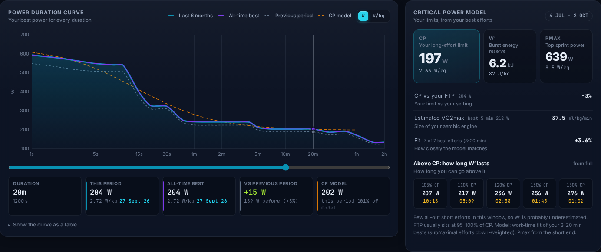
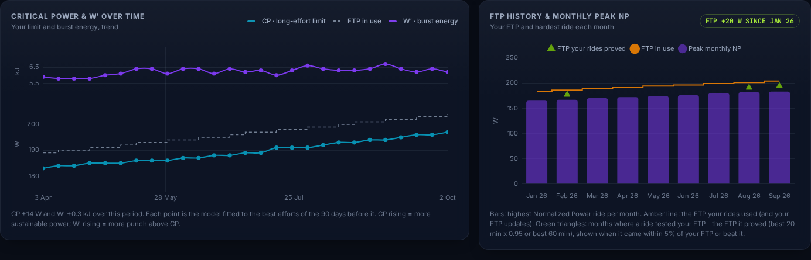
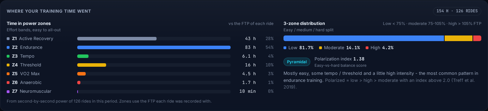
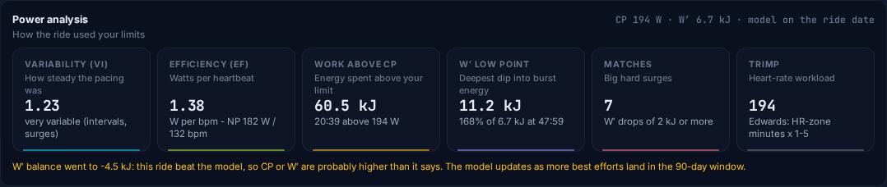
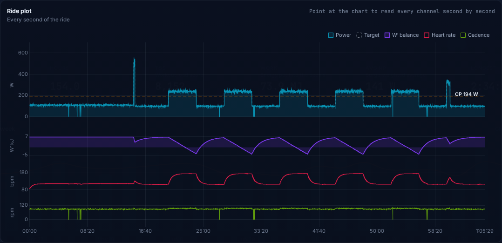
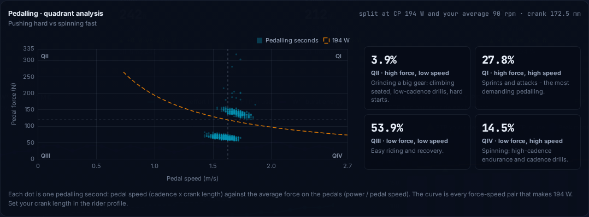
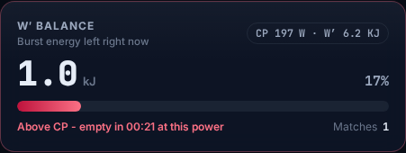

# Power analytics

Analysis for riders with a power meter: critical-power modelling, W′ balance, a full power duration curve, a stacked ride plot, power distribution, quadrant analysis, zone distributions and model estimates over time. It is fitted to how Apex is used (indoor, Assioma pedals + KICKR, ERG workouts). It keeps the app's look and its rule that only measured data is shown, and every acronym carries a short plain-English meaning under its name.

## What changed

| Feature | What you get | Where |
|---|---|---|
| Power duration curve | Your best power for every duration on a log-time axis from 1 s to 4 h: this period, all-time best (HealthFit archive included), the previous period, the CP model, and *This session* during a ride. A scrub readout links to the ride that set each best. Includes a W ↔ W/kg toggle and a table view. | Analytics › Power & CP |
| Critical power model | CP (*your long-effort limit*) and W′ (*burst energy reserve*) from the 3–20 min bests of the last 90 days, with submaximal efforts down-weighted. Pmax (*top sprint power*) from Morton's 3-parameter form. The card also shows CP vs FTP, estimated VO2max, fit error, and how long W′ lasts at 105–150 % of CP. | Analytics › Power & CP |
| CP & W′ over time | The model refitted along the page range, each point using its own 90 days, in two lanes with the FTP in use. | Analytics › Power & CP |
| Intensity distribution | Time in each power zone over the range, the easy / medium / hard split, the polarization index and the distribution type. A weekly **Zones** view stacks zone hours per week. | Analytics › Intensity, Weekly load › Zones |
| Ride plot | Power (target, CP line), W′ balance, heart rate and cadence in stacked lanes on one time axis. The readout under the pointer gives the exact second. | Ride review |
| Power analysis | Variability (VI), efficiency (EF), work and time above CP, W′ low point, matches (big hard surges), TRIMP (heart-rate workload). | Ride review |
| Ride power curve, power distribution | The ride's best power per duration against the 90 days before and the model, and time spent at each power, coloured by zone. | Ride review |
| Quadrant analysis | Pushing hard vs spinning fast: each pedalling second as pedal speed vs pedal force, split at CP and the ride's own cadence, with the % of time in each quadrant. Crank length is set in the rider profile. | Ride review |
| Live W′ balance | Burst energy left, in kJ and %, with *empty in m:ss at this power* and matches. Also on the phone's Session screen. | Cockpit, phone |
| Plain English | A short meaning under every acronym and metric (*TSS - workout load score*, *NP - surge-weighted average*), with the full name on hover. It comes from one glossary that matches Settings › Training terms explained. | Everywhere |

*Screenshots use synthetic test rides, not real rider data.*

### Model choice

A free Morton 3-parameter fit over 10 s–20 min put CP at or above the 20-min best on realistic curves. The hybrid used here puts CP at 92–97 % of the 20-min best for all-rounder, diesel and sprinter shapes:

- the 2-parameter work–time fit of the 3–20 min bests, with submaximal points down-weighted;
- Pmax from Morton's form with CP and W′ fixed.

When it can't give a sound answer, the app says so and shows no number:

- **no long effort:** no best at 12 min or more;
- **bad fit:** fit error over 8 %, or CP above the 20-min best;
- **few hard efforts:** W′ is flagged as likely underestimated.

### Faster analytics

The figures below come from 191 rides with second-by-second data:

| | Before | After |
|---|---|---|
| Full Analytics refresh | 550–700 ms | about 70 ms (warm) |
| Opening the Analytics tab | drew the power curve twice | draws it once |

How:

- **Cached ride curves:** each ride's power curve, zone times and EF are computed once and cached by ride and sample count. Recorded samples never change.
- **Faster labels:** the PMC builds its day labels with one shared formatter.
- **Linear trend line:** the resting HR/HRV trend went from O(n²) to O(n).
- **Lighter ride plot:** the drawing is decimated (peaks kept), while the readout still reads the full data.

### Chart fixes

- **No dual-axis plots:** resting HR and HRV each get their own lane, and so do CP and W′. Overlaying two scales on one plot invents correlations.
- **Zone legend:** times now sit next to their own zone label, in the cockpit and in the ride review.
- **Colour-blind check:** the power-curve series colours pass a colour-vision-deficiency check against the dark surface. That rules out lime next to amber.

## Next proposals (not built yet)

Ordered by value for an indoor power-meter rider.

1. **Durability (fatigue resistance).** Show best 5 / 20 min power after 1,000 and 2,000 kJ of work, and compare it with fresh bests. Long-ride resilience is a better predictor for events than fresh peaks, and it uses only the cached curves plus a running kJ index.
2. **Pedal dynamics from FIT imports.** Torque effectiveness, pedal smoothness, platform-centre offset and power phase. Assioma pedals report them over ANT+ when a head unit records them, but not over Bluetooth to the browser. The FIT importer could read these fields and the ride review could show them per leg, with no modelled data.
3. **CP-based zones and an FTP suggestion from the model.** Offer zones anchored on CP as an option. Use the model as a second source for the existing FTP suggestion, under the same conservative rules.
4. **Compare mode.** Overlay two rides, or two date ranges, on the ride plot and power curve. Useful for "same workout, 6 weeks apart".
5. **Effort finder for rides without targets.** Detect sustained efforts above CP and sprints from W′ use, and list them like interval execution. Strava and outdoor imports have no targets today.
6. **Persist ride curves.** Store each ride's curve in IndexedDB so the first Analytics load after start-up is instant. Today the first computation takes about 1 s for 190 rides.
7. **Heart rate vs power and HR lag.** A scatter of heart rate against power, and how quickly heart rate settles after a step in ERG. That is a clean aerobic-fitness signal on the trainer.
8. **Ride filter / search.** For example *IF > 0.85 and duration > 60 min*, shared by History, Analytics and the Calendar.
9. **Customisable overview tiles.** Let the rider choose and order the Today / progression tiles.
10. **Balance vs intensity.** Show L/R balance by power band and per interval. Many riders shift balance as power rises, and Apex already has the measured balance.
11. **Event projection.** Project the PMC forward from the training-block plan to show expected fitness and freshness on an event date.
12. **Header labels.** Keep the page labels visible at ordinary desktop widths (from the September review). Today, below 1760 px only the active tab shows its label.

## Verification

- `node --test tests/*.test.js`: every test passes except one skip (the PowerShell server test, which needs `pwsh`). Two test files are new:
  - `tests/power-model.test.js` checks that the 1 s–4 h curve equals the existing peak maths exactly, plus the CP fits, W′ balance, matches, TRIMP, quadrants and polarization.
  - `tests/glossary.test.js` checks that every plain-English key the app uses exists and stays short.
- `test_suite.html`: every check passes. This needed a synthetic stand-in for the personal HealthFit archive (`data/divan_cycling_history.js` is not in Git). Two existing checks were updated for the new curve data shape with the same intent. A new end-to-end check covers the CP model, power curve, CP card, zones, CP history, weekly zones, ride plot lanes, the plain-English subtext, chart clean-up on close, and live W′ in the cockpit and phone snapshot.
- Screenshots were rendered at 1440 px and 390 px (Analytics, ride review, cockpit, History, Calendar, phone Session screen) with no page errors.
- **Not verified:**
  - real Bluetooth devices or a real phone;
  - the rider's real ride archive.
